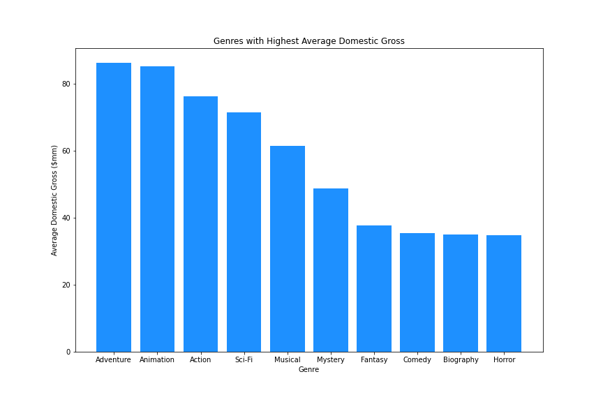
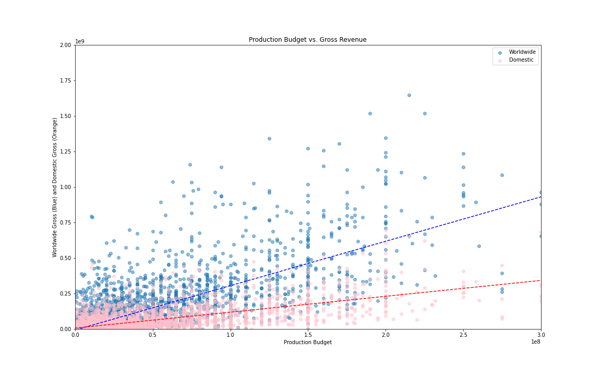

# Phase 1 Project
## Project Outline

### Title
#### Authors: Kevin McDonough and Victor Chen
### Overview
This project analyzes historical movie data to create recommendations that will enable Microsoft to build a successful movie studio. Based on data from IMDB, Rotten Tomatoes, and The Numbers, we identify characteristics of succcessful past films. These characteristics, such as target genres and ideal plot themes, will aid Microsoft in creating profitable movies as well as provide insight into where the company should (and should not) devote resources. 

### Business Problem
Microsoft sees all the big companies creating original video content and they want to get in on the fun. They have decided to create a new movie studio, but they don’t know anything about creating movies. You are charged with exploring what types of films are currently doing the best at the box office. You must then translate those findings into actionable insights that the head of Microsoft's new movie studio can use to help decide what type of films to create.

### Data
We have three unique data sets that we work from. Each provides unique information:

* [IMDB](https://www.imdb.com/): An online database with information related to films, television, streaming content, and video games. This data set was pulled from Kaggle, and has the 5000 highest gross domestic movies prior to 2018. It was specifically useful in analyzing the relationship between directors, actors, genres, themes, and keywords with box office success.  
* [Rotten Tomatoes](https://www.rottentomatoes.com/): An online aggregator of movie and tv show reviews from audiences and critics. This data set helped us determine the correlation, or lack thereof, between critic ratings and box office success.
* [The Numbers](https://www.the-numbers.com/): A film industry data website that tracks box office revenue in a systemic, algorithmic way. This data set was particularly useful for finding the relationship between production costs, domestic gross, and worldwide gross. 

### Methods
Descriptive analysis, keyword analysis based on trends
Audience reception based on ratings and box office gross

### Results

#### Rotten Tomatoes Ratings Versus Box Office Revenue

Using rotten tomatoes data, we created a scatterplot comparing box office success (y axes) with average critic scores (x axes). We used two different measures of critic ratings in the charts above. On the left, we created a 'standardized' score that took each reviewers score and returned a number out of 100. For example, if the critic gave a 4/5 we turned that into an 80, whereas if the critic gave a 'B', we turned that into an 85. On the right, we used the Rotten Tomatoes 'Tomatometer.' This number represents that percentage of critics who rated the movie 'fresh'. The two charts above showed us that box office success was not correlated with critic score. The correlation between box office revenue and our 'standardized' rating is .102 and the correlation between box office revenue and the tomatometer is .066. Although making a movie that is well-received by critics would be great, our goal is to make money. Moving forward we will try to identify ways to maximize box office revenue, not critic scores. 

#### Features of Box Office Success 

The Chart above shows us the average box office revenue for movies in each genre. According to the data, the top 5 most profitable genres are Family, Action, Adventure, Animation and Musical. 

The boxplot above provides additional information regarding genre profitability. Although Family movies have the highest average domestic box office revenue, we can see that the median is much lower than the other genres, so the data must be skewed by a couple big earners. The boxplot also shows us that many of the highest earning movies are in either the adventure or action genres. We believe Microsoft should create a movie in one of these five genres, and, moving forward, we will subset the IMDB data to only include movies from these categories. 

After subsetting the data to include movies from our specified genres, we identified the directors that, on average create the highest-earning movies. The chart above gives us the 10 directors who have the highest grossing Action/Adventure/Family/Animation/Musical Movies. We think Microsoft should hire one of these individuals to direct their first movie because they all have a proven track record. 

After settling on candidates to direct the movie, we attempted to identify actors for the lead roles. The above chart shows us the actors whose movies on average earn the highest within our genre subset. The Y axis is the average domestic revenue of movies they starred in. 

Settling on a director and cast, we next wanted to identify plot themes that we belive Microsoft should focus on. The IMDB data gives us 5 key plot themes for each movie. for example, the keyword column entry for the movie Avatar is 'avatar|future|marine|native|paraplegic'. We compiled all of the keywords in the data set. Here are the words that appear most frequently: 

The theme 'love' appears most often, awwwwwww! After compiling all the plot themes, we filtered based on the average gross revenue for different themes and then sorted from highest to lowest. Here is the result of that analysis: 

The Y axis represents the average gross domestic revenue for movies that have the associated keyword in their description. For example, movies that have 'superhero' as a keyword earn $149.6mm on average. Using this info, we believe that Microsoft should create a movie that focuses on one or more of these themes because they have proven to be profitable and therefore appealing to audiences. 

#### Movies with Higher Budgets are More successful at the Box Office

We are well aware that the recommendations we made for genre, actor, director and plot theme won't be cheap. The genres we identified tend to require large budgets for special effects, and the indiviuals we identified to direct and cast will command large salaries due to their past successes. That being said, the chart above shows us that there is a high correlation between budget and box office success. Production budget is on the x axis and box office gross revenue is on the y axis. The blue dots represent a particular movie's worldwide gross revenue whereas pink dots denote a movie's domestic gross revenue. The key takeaway is that movies with higher budgets generally earn more at the box office, and there is a significant correlation between domestic gross revenue and worldwide gross revenue. The analysis we did previously focused on domestic gross revenue, and this correlation reassures us that we can extrapolate our conclusions to the worldwide market. The table below gives a good depiction of the Pearson correlation coefficients for each gross revenue:

| Correlation Coefficient | Worldwide Gross | Domestic Gross  |
| ----------------------- | --------------- | --------------- |
| Production Budget       |  0.748306       |    0.685682     |

Based on what we see of the scatterplot above, as well as the trend lines, there is a positive correlation for both, with the worldwide gross having a considerably higher correlation. Releasing a film internationally generally gives better returns than releasing a film purely domestically.

Taking a look at the trend line linear equations:

worldwide gross: y=3.126943x+(-7285667.054592)

domestic gross: y2=1.119087x+(6523888.576660)

While this is a simple linear equation given the data points in the data set, and given that this gives only a rough estimation of a predicted gross box office result, it is at least something to help give us an idea of the relationship between the production budget and an estimated box office gross. Further, we can look to variance to help us determine the volatility, or risk factor, of each equation. 

|           | Worldwide Gross | Domestic Gross  |
| --------- | --------------- | --------------- |
| Variance  |  3.052 * 10^16  | 4.656 * 10^15   |

The variance of the domestic gross movies is much lower than that of the worldwide gross, indicating to us that the volatility of box office earnings is lower for domestic box offices than it is for international box offices. 

### High-Level Conclusions from Data Analysis 
  1. There is no significant correlation between ratings and box office success; although creating a critically-accalimed movie would be fantastic, we are more focused on box office success. 
  2. There are certain genres, actors, directors and plot themes that are associated with high-earning movies
  3. There is a significant correlation between production cost and domestic/worldwide gross. You gotta spend money to make money! 

### Recommendations
  1. Don't exclusively focus on directors and actors with high IMDB/Rotten Tomatoes ratings
  2. Specific recommendations for genres, directors, actors, themes:
     1. **Target Genres:** Family, Action, Adventure, Animation, Musical
     2. **Target Directors:** Joss Whedon, George Lucas, Christopher Nolan, Andrew Adamson, Peter Jackson
     3. **Target Actors:** Robert Downey, Robert Pattinson, Jennifer Lawrence, Kevin Dunn, Scarlett Johansson, Daniel Radcliffe, Jon Favreau, Orlando Bloom, John      Ratzenberger, Albert Finney
     4. **Target Themes:** superhero, princess, magic, battle, monster, assasin, terrorist, soldier, professor, king, future, spy, vampire, president, alien, island, CIA, scientist, revenge
  3. Although creating a movie based on these recommendations may be expensive, it is worth it. There is a high correlation between budget and box office success. 

### Next Steps
  - Best combinations of actors and directors (optimization)
### Repo Structure
