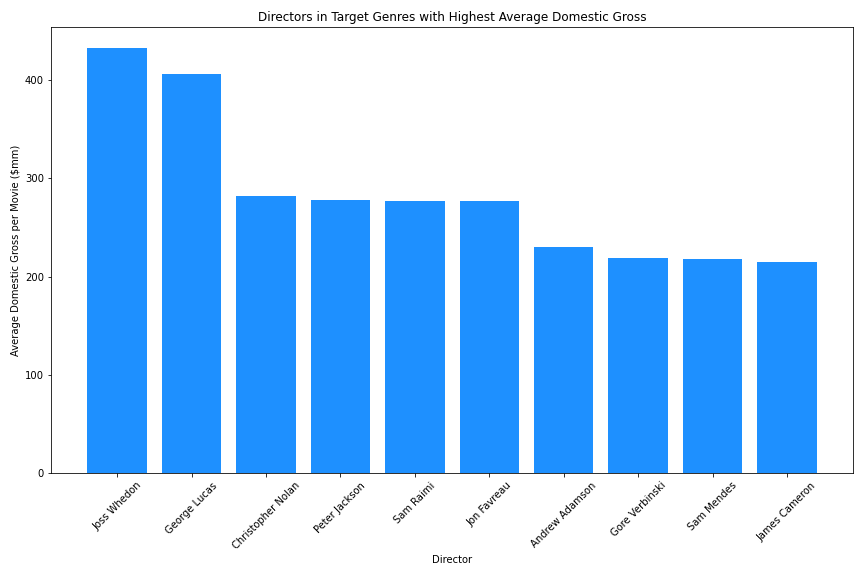
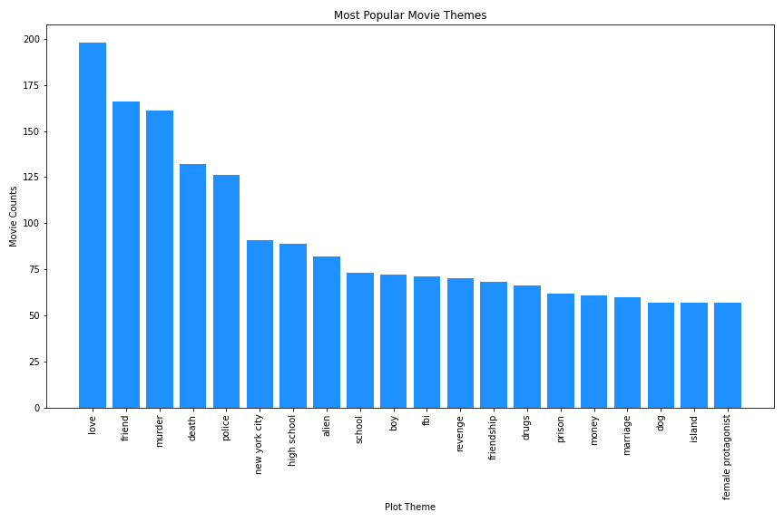

# Phase 1 Project
## Project Outline

### Title
#### Authors: Kevin McDonough and Victor Chen
### Overview
This project analyzes historical movie data to create recommendations for the highest likelihood of box office success. Based on data from IMDB, Rotten Tomatoes, and The Numbers, we identify characteristics of succcessful past films to give actionable insight for Microsoft to create a profitable film department.

### Business Problem
Microsoft sees all the big companies creating original video content and they want to get in on the fun. They have decided to create a new movie studio, but they don’t know anything about creating movies. You are charged with exploring what types of films are currently doing the best at the box office. You must then translate those findings into actionable insights that the head of Microsoft's new movie studio can use to help decide what type of films to create.

### Data
We have three unique data sets that we work from. Each provides information in specific ways:

IMDB: An online database with information related to films, television, streaming content, and video games. This data set was pulled from Kaggle, and has the 5000 highest gross domestic movies prior to 2018. It was specifically useful in analyzing the relationship between directors, actors, genres, themes, and keywords with box office success.  
Rotten Tomatoes: A online aggregator of movie and tv show reviews from audiences and critics. This data set helped us determine the correlation, or lack thereof, between critic ratings and box office success.
The Numbers: A film industry data website that tracks box office revenue in a systemic, algorithmic way. This data set was particularly useful for finding the relationship between production costs, domestic gross, and worldwide gross. 

### Methods
Descriptive analysis, keyword analysis based on trends
Audience reception based on ratings and box office gross

### Results (Visualizations)

### Conclusions (Recommendations based on results)
  1. No significant correlation between ratings and box office success, no need to focus in on genres, directors, and actors based on high ratings, should focus instead on high earnings
  2. recommendations for genres, directors, actors, and key themes that lead to high domestic gross
  3. correlation between production cost and domestic/worldwide gross is significant

### Recommendations
  1. Don't exclusively focus on directors and actors with high ratings
  2. Specific recommendations for genres, directors, actors, themes
  3. estimated return on investment for specific budget (point that maximizes return)

### Next Steps
  - Best combinations of actors and directors (optimization)
### Repo Structure

## Project Overview

For this project, you will use exploratory data analysis to generate insights for a business stakeholder.

### Business Problem

Microsoft sees all the big companies creating original video content and they want to get in on the fun. They have decided to create a new movie studio, but they don’t know anything about creating movies. You are charged with exploring what types of films are currently doing the best at the box office. You must then translate those findings into actionable insights that the head of Microsoft's new movie studio can use to help decide what type of films to create.

### The Data

In the folder `zippedData` are movie datasets from:

* [Box Office Mojo](https://www.boxofficemojo.com/)
* [IMDB](https://www.imdb.com/)
* [Rotten Tomatoes](https://www.rottentomatoes.com/)
* [TheMovieDB](https://www.themoviedb.org/)
* [The Numbers](https://www.the-numbers.com/)

It is up to you to decide what data from this to use and how to use it. If you want to make this more challenging, you can scrape websites or make API calls to get additional data. If you are feeling overwhelmed or behind (e.g. struggled with the Phase 1 Code Challenge), we recommend you use only the following data files:

* imdb.title.basics
* imdb.title.ratings
* bom.movie_gross

## Deliverables

There are three deliverables for this project:

* A **GitHub repository**
* A **Jupyter Notebook**
* A **non-technical presentation**

Review the "Project Submission & Review" page in the "Milestones Instructions" topic for instructions on creating and submitting your deliverables. Refer to the rubric associated with this assignment for specifications describing high-quality deliverables.

### Key Points

* **Your analysis should yield three concrete business recommendations.** The ultimate purpose of exploratory analysis is not just to learn about the data, but to help an organization perform better. Explicitly relate your findings to business needs by recommending actions that you think the business (Microsoft) should take.

* **Communicating about your work well is extremely important.** Your ability to provide value to an organization - or to land a job there - is directly reliant on your ability to communicate with them about what you have done and why it is valuable. Create a storyline your audience (the head of Microsoft's new movie studio) can follow by walking them through the steps of your process, highlighting the most important points and skipping over the rest.

* **Use plenty of visualizations.** Visualizations are invaluable for exploring your data and making your findings accessible to a non-technical audience. Spotlight visuals in your presentation, but only ones that relate directly to your recommendations. Simple visuals are usually best (e.g. bar charts and line graphs), and don't forget to format them well (e.g. labels, titles).

## Getting Started

Please start by reviewing this assignment, the rubric at the bottom of it, and the "Project Submission & Review" page. If you have any questions, please ask your instructor ASAP.

Next, we recommend you check out [the Phase 1 Project Templates and Examples repo](https://github.com/learn-co-curriculum/dsc-project-template) and use the MVP template for your project.

Alternatively, you can fork [the Phase 1 Project Repository](https://github.com/learn-co-curriculum/dsc-phase-1-project), clone it locally, and work in the `student.ipynb` file. Make sure to also add and commit a PDF of your presentation to your repository with a file name of `presentation.pdf`.

## Project Submission and Review

Review the "Project Submission & Review" page in the "Milestones Instructions" topic to learn how to submit your project and how it will be reviewed. Your project must pass review for you to progress to the next Phase.

## Summary

This project will give you a valuable opportunity to develop your data science skills using real-world data. The end-of-phase projects are a critical part of the program because they give you a chance to bring together all the skills you've learned, apply them to realistic projects for a business stakeholder, practice communication skills, and get feedback to help you improve. You've got this!
