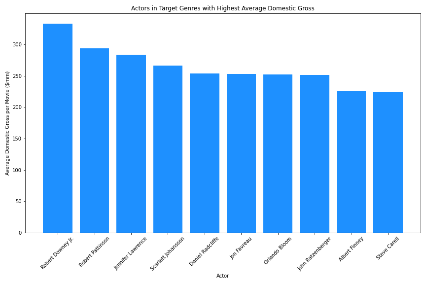
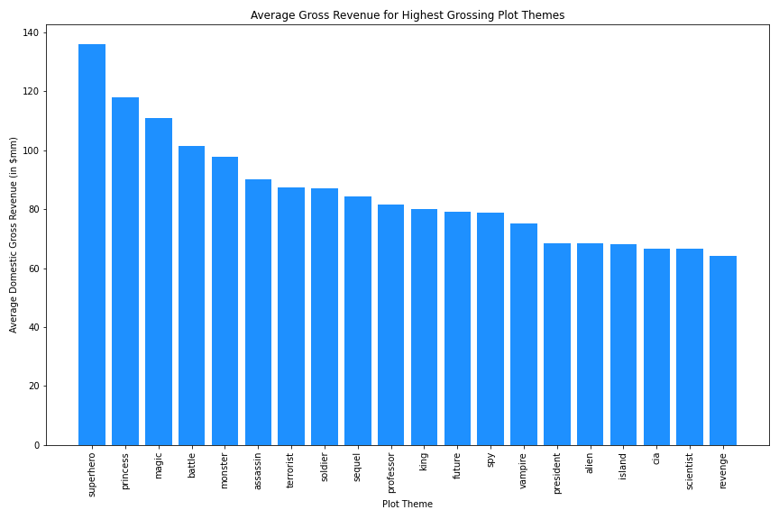

# Phase 1 Project
## Project Outline

### Title
#### Authors: Kevin McDonough and Victor Chen
### Overview
This project analyzes historical movie data to create recommendations for the highest likelihood of box office success. Based on data from IMDB, Rotten Tomatoes, and The Numbers, we identify characteristics of succcessful past films to give actionable insight for Microsoft to create a profitable film department.

### Business Problem
Microsoft sees all the big companies creating original video content and they want to get in on the fun. They have decided to create a new movie studio, but they don’t know anything about creating movies. You are charged with exploring what types of films are currently doing the best at the box office. You must then translate those findings into actionable insights that the head of Microsoft's new movie studio can use to help decide what type of films to create.

### Data
We have three unique data sets that we work from. Each provides information in specific ways:

IMDB: An online database with information related to films, television, streaming content, and video games. This data set was pulled from Kaggle, and has the 5000 highest gross domestic movies prior to 2018. It was specifically useful in analyzing the relationship between directors, actors, genres, themes, and keywords with box office success.  
Rotten Tomatoes: A online aggregator of movie and tv show reviews from audiences and critics. This data set helped us determine the correlation, or lack thereof, between critic ratings and box office success.
The Numbers: A film industry data website that tracks box office revenue in a systemic, algorithmic way. This data set was particularly useful for finding the relationship between production costs, domestic gross, and worldwide gross. 

### Methods
Descriptive analysis, keyword analysis based on trends
Audience reception based on ratings and box office gross

### Results (Visualizations)

#### Rotten Tomatoes Ratings Versus Box Office Revenue

Using rotten tomatoes data, we created a scatterplot comparing box office success (y axes) with average critic scores (x axes). We used two different measures of critic ratings in the charts above. On the left, we created a 'standardized' score that took each reviewers score and returned a number out of 100. For example, if the critic gave a 4/5 we turned that into an 80, whereas if the critic gave a 'B', we turned that into an 85. On the right, we used the Rotten Tomatoes 'Tomatometer.' This number represents that percentage of critics who rated the movie 'fresh'. The two charts above showed us that box office success was not correlated with critic score. The correlation between box office revenue and our 'standardized' rating is .102 and the correlation between box office revenue and the tomatometer is .066. Although making a movie that is well-received by critics would be great, our goal is to make money. Moving forward we will try to identify ways to maximize box office revenue, not critic scores. 

#### Features of Box Office Success 

The Chart above shows us the average box office revenue for movies in each genre. According to the data the top 5 most profitable genres are Family, Action, Adventure, Animation and Musical. 

The boxplot above provides additional information regarding genre profitability. Although Family movies have the highest average domestic box office revenue, we can see that the median is much lower than the other genres, so the data must be skewed by a couple big earners. The boxplot also shows us that many of the highest earning movies are in either the adventure or action genres. We believe Microsoft should create a movie in one of these five genres, and, moving forward, we will subset the IMDB data to only include movies from these categories. 

After subsetting the data to include movies from our specified genres, we identified the directors that, on average create the highest-earning movies. The chart above gives us the 10 directors who have the highest grossing Action/Adventure/Family/Animation/Musical Movies. We think Microsoft should higher one of these individuals to direct their first movie because they all have a proven track record. 

After settling on candidates to direct the movie, we attempted to identify actors for the lead roles. The above chart shows us the actors whose movies on average earn the highest within our genre subset. The Y axis is the average domestic revenue of movies they starred in. 

Settling on a director and cast, we next wanted to identify plot themes that we belive Microsoft should focus on. The IMDB data gives us 5 key plot themes for each movie. for example, the keyword column entry for the movie Avatar is 'avatar|future|marine|native|paraplegic'. We compiled all of the keywords in the data set. Here are the words that appear most frequently: 

The theme 'love' appears most often, awwwwwww! After compiling all the plot themes, we filtered based on the average gross revenue for different themes and then sorted from highest to lowest. Here is the result of that analysis: 

The Y axis represents the average gross domestic revenue for movies that have the associated keyword in their description. For example, movies that have 'superhero' as a keyword earn $149.6mm on average. Using this info, we believe that Microsoft should create a movie that focuses on one or more of these themes because they have proven to be profitable and therefore appealing to audiences. 

#### Movies with Higher Budgets are More successful at the Box Office

We are well aware that the recommendations we made for genre, actor, director and plot theme won't be cheap. The genres we identified tend to require large budgets for special effects, and the indiviuals we identified to direct and cast will command large salaries due to their past successes. That being said, the chart above shows us that there is a high correlation between budget and box office success. Production budget is on the x axis and box office gross revenue is on the y axis. The blue dots represent a particular movie's worldwide gross revenue whereas pink dots denote a movie's domestic gross revenue. The key takeaway is that movies with higher budgets generally earn more at the box office, and there is a large correlation between domestic gross revenue and worldwide gross revenue. The analysis we did previously focused on domestic gross revenue, and this correlation reassures us that we can extrapolate our conclusions to the worldwide market. 

### Conclusions (Recommendations based on results)
  1. No significant correlation between ratings and box office success, no need to focus in on genres, directors, and actors based on high ratings, should focus instead on high earnings
  2. recommendations for genres, directors, actors, and key themes that lead to high domestic gross
  3. correlation between production cost and domestic/worldwide gross is significant

### Recommendations
  1. Don't exclusively focus on directors and actors with high ratings
  2. Specific recommendations for genres, directors, actors, themes
  3. estimated return on investment for specific budget (point that maximizes return)

### Next Steps
  - Best combinations of actors and directors (optimization)
### Repo Structure

## Project Overview

For this project, you will use exploratory data analysis to generate insights for a business stakeholder.

### Business Problem

Microsoft sees all the big companies creating original video content and they want to get in on the fun. They have decided to create a new movie studio, but they don’t know anything about creating movies. You are charged with exploring what types of films are currently doing the best at the box office. You must then translate those findings into actionable insights that the head of Microsoft's new movie studio can use to help decide what type of films to create.

### The Data

In the folder `zippedData` are movie datasets from:

* [Box Office Mojo](https://www.boxofficemojo.com/)
* [IMDB](https://www.imdb.com/)
* [Rotten Tomatoes](https://www.rottentomatoes.com/)
* [TheMovieDB](https://www.themoviedb.org/)
* [The Numbers](https://www.the-numbers.com/)

It is up to you to decide what data from this to use and how to use it. If you want to make this more challenging, you can scrape websites or make API calls to get additional data. If you are feeling overwhelmed or behind (e.g. struggled with the Phase 1 Code Challenge), we recommend you use only the following data files:

* imdb.title.basics
* imdb.title.ratings
* bom.movie_gross

## Deliverables

There are three deliverables for this project:

* A **GitHub repository**
* A **Jupyter Notebook**
* A **non-technical presentation**

Review the "Project Submission & Review" page in the "Milestones Instructions" topic for instructions on creating and submitting your deliverables. Refer to the rubric associated with this assignment for specifications describing high-quality deliverables.

### Key Points

* **Your analysis should yield three concrete business recommendations.** The ultimate purpose of exploratory analysis is not just to learn about the data, but to help an organization perform better. Explicitly relate your findings to business needs by recommending actions that you think the business (Microsoft) should take.

* **Communicating about your work well is extremely important.** Your ability to provide value to an organization - or to land a job there - is directly reliant on your ability to communicate with them about what you have done and why it is valuable. Create a storyline your audience (the head of Microsoft's new movie studio) can follow by walking them through the steps of your process, highlighting the most important points and skipping over the rest.

* **Use plenty of visualizations.** Visualizations are invaluable for exploring your data and making your findings accessible to a non-technical audience. Spotlight visuals in your presentation, but only ones that relate directly to your recommendations. Simple visuals are usually best (e.g. bar charts and line graphs), and don't forget to format them well (e.g. labels, titles).

## Getting Started

Please start by reviewing this assignment, the rubric at the bottom of it, and the "Project Submission & Review" page. If you have any questions, please ask your instructor ASAP.

Next, we recommend you check out [the Phase 1 Project Templates and Examples repo](https://github.com/learn-co-curriculum/dsc-project-template) and use the MVP template for your project.

Alternatively, you can fork [the Phase 1 Project Repository](https://github.com/learn-co-curriculum/dsc-phase-1-project), clone it locally, and work in the `student.ipynb` file. Make sure to also add and commit a PDF of your presentation to your repository with a file name of `presentation.pdf`.

## Project Submission and Review

Review the "Project Submission & Review" page in the "Milestones Instructions" topic to learn how to submit your project and how it will be reviewed. Your project must pass review for you to progress to the next Phase.

## Summary

This project will give you a valuable opportunity to develop your data science skills using real-world data. The end-of-phase projects are a critical part of the program because they give you a chance to bring together all the skills you've learned, apply them to realistic projects for a business stakeholder, practice communication skills, and get feedback to help you improve. You've got this!
